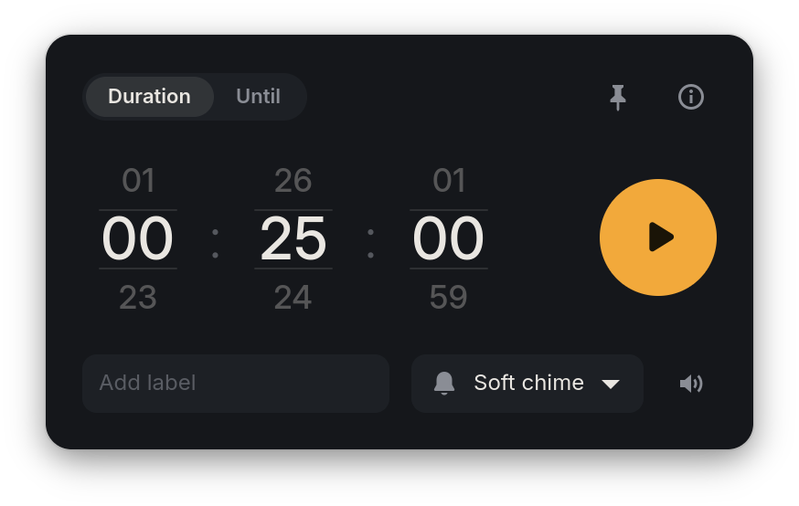
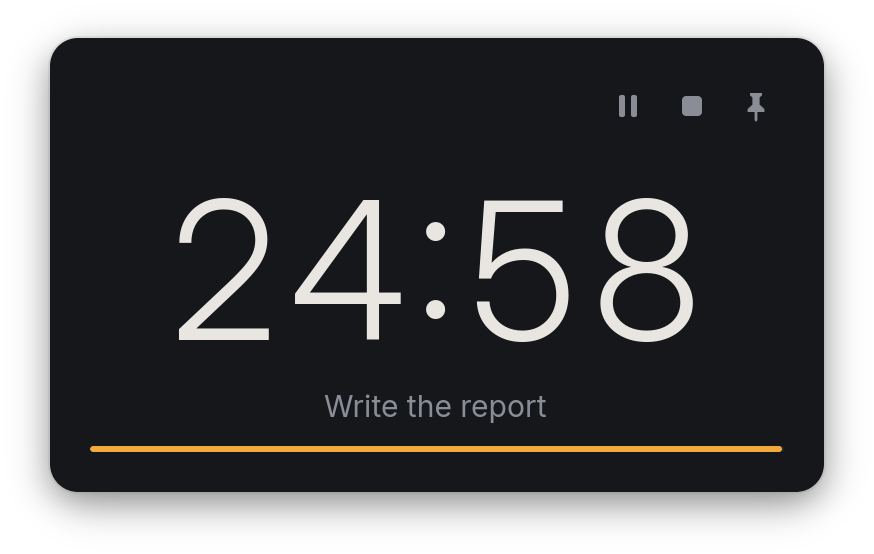
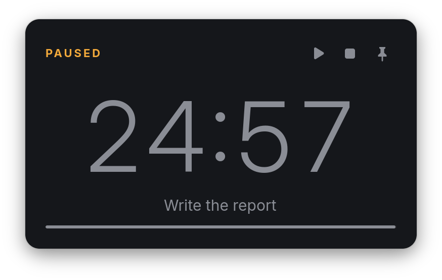
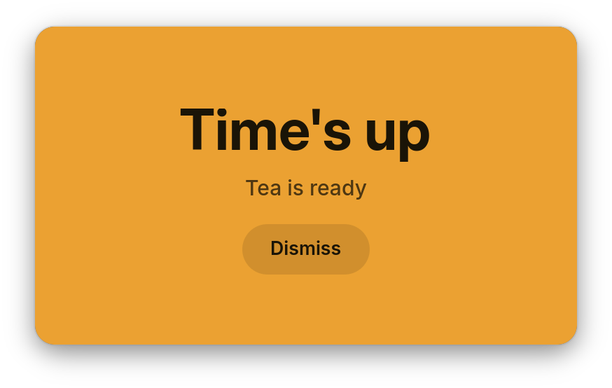
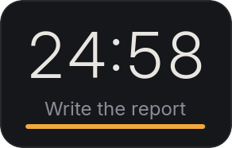

# Glance

A small, keyboard-first countdown timer for Linux on Wayland. Type a duration, press Enter, and the time left stays big and readable. Pin it above your windows or shrink it into a corner while you work. GTK 4 and Vala, made first for [niri](https://github.com/YaLTeR/niri).

<p align="center">
  
  
</p>
<p align="center">
  
  
  
</p>

- Type `25.` for 25 minutes, or roll the wheels with a mouse, touchpad or arrow keys.
- Count down a duration, or count down to a time of day.
- When time is up the whole window turns amber and plays a short alarm.
- **Pinned** keeps Glance above every window; **Peek** shrinks a running timer into a corner.
- `glance-timer 25m`, `--pause` and `--add 5m` drive the running timer from scripts and key bindings.
- One timer, offline, no accounts, no tracking.

## Install

You need Meson, Vala, GTK 4.20 or newer, gtk4-layer-shell and GStreamer.

    meson setup build
    meson compile -C build
    sudo meson install -C build

On Arch, `cd packaging/arch && makepkg -si` builds and installs the `glance-timer` package.

## TODO

- Publish the package on the AUR.
- Publish on Flathub.

## Using it

Run `glance-timer` and type:

| Type | Starts |
|---|---|
| `45` | 45 seconds |
| `25.` | 25 minutes |
| `1..` | 1 hour |
| `1.30` | 1 minute 30 seconds |
| `130.` | 1 hour 30 minutes |
| `1.2.3` | 1:02:03 |

Digits fill from the right; a dot moves what you typed up one unit. Enter starts. Switch to **Until** to count down to a time of day. The label is optional.

| Where | Key | Action |
|---|---|---|
| Setup | digits, `.` | type a duration |
| | Backspace | remove the last key |
| | Enter | start |
| | Escape | clear |
| | ↑ ↓, Page Up/Down, Home/End | change the focused wheel |
| Running, paused | Space | pause or resume |
| | Enter, Escape | stop |
| Time's up | Enter, Escape | dismiss |

Closing the window while a timer runs only hides it. Run `glance-timer` again to bring it back.

### Command line

Every call talks to the one running Glance; the first call starts it.

    glance-timer                              show the window
    glance-timer 25m                          start 25 minutes now
    glance-timer 1h 30m --label "Deep work"
    glance-timer --until 14:30 --label "Standup"
    glance-timer --pause | --resume
    glance-timer --stop                       stop, or dismiss a finished timer
    glance-timer --reset                      restart from the full duration
    glance-timer --add 5m
    glance-timer --show | --hide
    glance-timer --pin | --peek | --window

Durations need a unit, so `glance-timer 25` is an error. Errors exit 1, success prints nothing.

### Pinned and Peek

**Pinned** keeps the full window above everything in the top-right corner. It only takes keyboard focus when you click it.

**Peek** shrinks a running timer into a small corner display. Click it, or run `glance-timer --window`, to get the window back.

Both need layer shell: niri, Sway, Hyprland, KDE Plasma, COSMIC and most wlroots compositors. The mode is remembered.

### Settings

There is no preferences screen. Pick the alarm in the window; the rest is `gsettings`:

    gsettings set io.github.mariocesar.Glance alarm-volume 0.5          # 0 to 1, default 0.8
    gsettings set io.github.mariocesar.Glance peek-corner bottom-left   # top-left, top-right, bottom-left, bottom-right
    gsettings set io.github.mariocesar.Glance alarm bell                # soft-chime, bell, digital, pulse, classic, none
    gsettings set io.github.mariocesar.Glance presentation-mode window  # window, pinned, peek

## niri

niri opens Glance floating. To put it in the top-right corner:

```kdl
window-rule {
    match app-id=r#"^io\.github\.mariocesar\.Glance$"#
    open-floating true
    default-floating-position x=16 y=16 relative-to="top-right"
}
```

Some key bindings:

```kdl
binds {
    Mod+T { spawn "glance-timer"; }
    Mod+Alt+T { spawn "glance-timer" "25m"; }
    Mod+Alt+Space { spawn-sh "glance-timer --pause || glance-timer --resume"; }
    Mod+Alt+BackSpace { spawn "glance-timer" "--stop"; }
}
```

Glance never steals focus. A visible timer that finishes turns amber and rings where it is; only a hidden window comes back. No desktop notifications, on purpose.

## Privacy

Works offline. No network, analytics, telemetry or accounts. It only stores the four settings above.

## Development

    meson setup build
    just run           # build and run from the build dir
    just test
    just screenshots   # retake the screenshots above, on niri

The alarm sounds are original, made by `data/sounds/generate.py`.

## License

MIT
